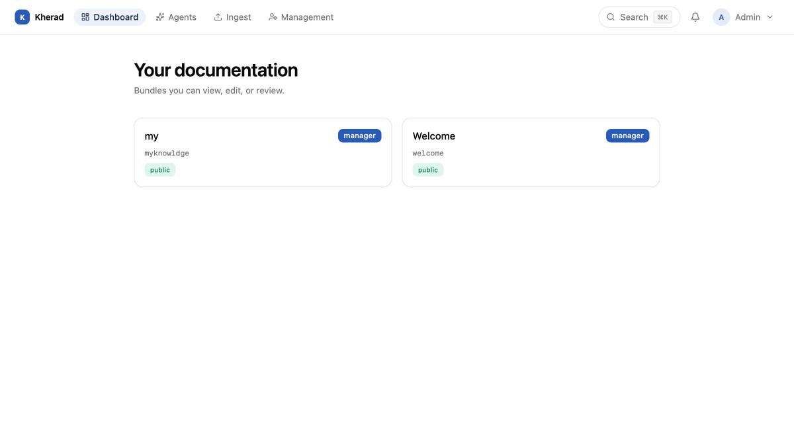
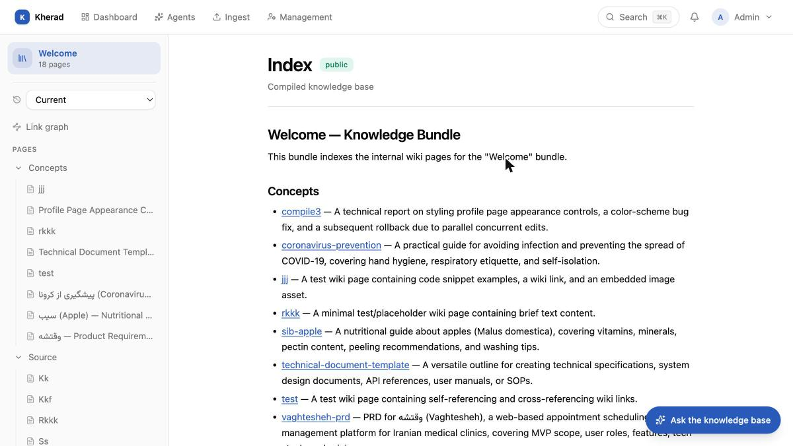
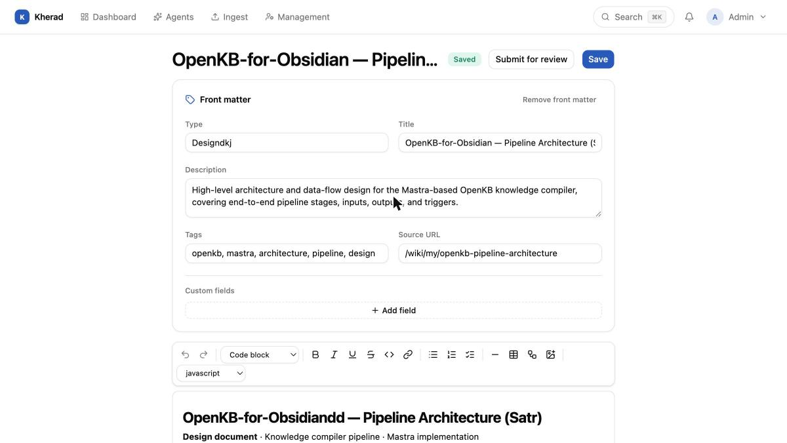
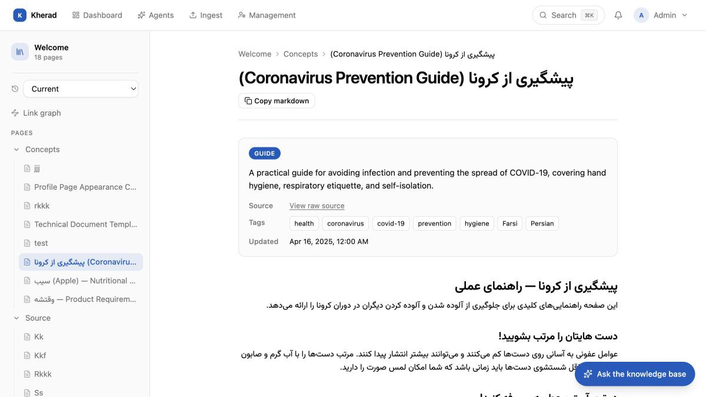
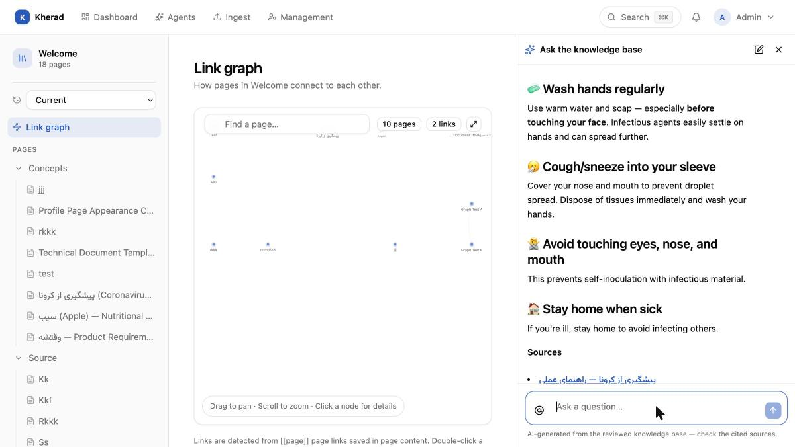
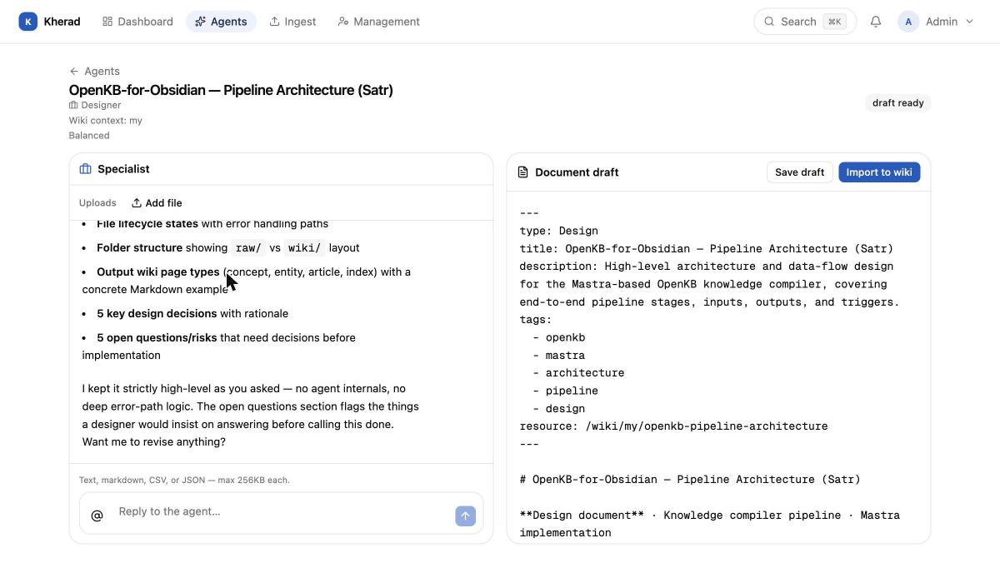
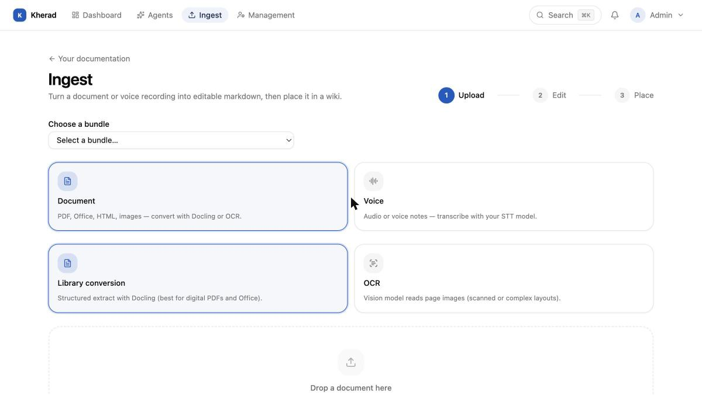
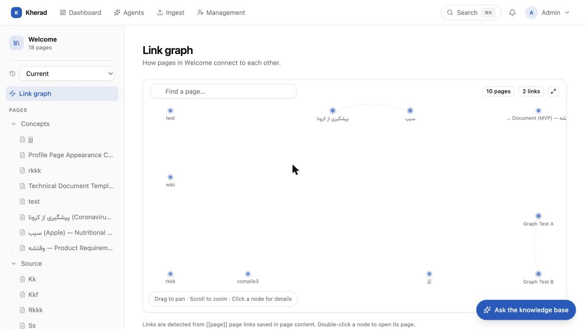

<div align="center">
  

  <h1>Kherad</h1>

  <p><strong>A Notion-like wiki for non-technical teams, backed by real git commits and a merge-request review workflow — plus AI agents that write the first draft for you.</strong></p>

  <p>
    <a href="LICENSE"></a>
    <a href="https://www.typescriptlang.org/"></a>
    <a href="https://nextjs.org/"></a>
    <a href="https://fastify.dev/"></a>
    <a href="https://turborepo.com/"></a>
    <a href="https://pnpm.io/"></a>
  </p>

  <p>
    <a href="#features">Features</a> ·
    <a href="#screenshots">Screenshots</a> ·
    <a href="#architecture">Architecture</a> ·
    <a href="#getting-started">Getting Started</a>
  </p>
</div>

Kherad is a self-hosted, git-backed knowledge base. Authors get a block editor that feels like Notion or Google Docs; under the hood, every save is a real commit, every publish goes through review, and the full history is never lost. Non-technical writers never see the words "branch" or "merge" — reviewers are the only ones who ever touch that layer, and only when resolving a conflict.

> Internal tool, open-sourced. Single-instance, Docker Compose deployment — built for one organization's internal docs, not as a multi-tenant SaaS.

## Screenshots

| | |
|---|---|
| **Dashboard** — bundles you can view, edit, or review | **Wiki reader** — rendered docs with a live link graph and "ask the knowledge base" |
|  |  |
| **Block editor** — Notion-style editing, front matter, tables, code, Mermaid | **RTL & i18n** — first-class support for right-to-left languages |
|  |  |
| **Ask the knowledge base** — RAG chat over your docs, with cited sources | **AI specialist agent** — pick a role, answer a few questions, get a wiki-ready draft |
|  |  |
| **Document ingest** — PDF/Office/HTML/OCR/voice → editable markdown | **Link graph** — how pages reference each other |
|  |  |

## Features

- **Real git underneath, zero git UX for authors.** Every user edits on their own long-lived branch (`user/<id>`). Autosave writes to a draft row for crash recovery; an explicit **Save** is the only thing that produces a commit. **Submit for review** opens a merge request; on approval it's squash-merged into the bundle's live branch with clean history.
- **Merge-request review workflow.** Line-based markdown diffs, inline comments, approve/reject, and a conflict-marker editor for the rare case reviewers need to resolve one by hand.
- **Block editor, markdown source of truth.** Lexical-based, round-trips to markdown — headings, nested lists, GFM tables, syntax-highlighted code blocks, and **Mermaid diagrams with live in-editor preview**.
- **Bundles, roles, and per-path permissions.** Group pages into bundles (by team/product/department); assign Admin / Manager (reviewer) / Author / Viewer per bundle or per folder, with public bundles readable anonymously.
- **AI agents that draft the page for you.** Pick a company role (or none) and the specialist agent interviews you, researches the existing wiki, and produces a wiki-ready markdown draft you can import directly.
- **"Ask the knowledge base."** A RAG chat panel available on every wiki, answering from the reviewed content with cited sources — not a generic LLM answering from nowhere.
- **Document & voice ingest.** Drop in a PDF, Office doc, HTML, or scanned image (Docling + OCR vision model) or a voice recording (speech-to-text) and get an editable markdown draft, ready to place into a bundle.
- **AI-compiled bundles.** Point a bundle at a folder of raw source documents and let an LLM pipeline compile them into a structured, navigable wiki (concepts/entities/articles), separate from bundles you write by hand.
- **Link graph.** Visualize how pages cross-reference each other via `[[wiki links]]`.
- **RTL and multi-language content**, out of the box.
- **Postgres full-text search**, permission-filtered at query time.
- Soft "someone else is editing" presence banner instead of a hard lock — one branch per user already prevents real collisions.

## Architecture

Turborepo monorepo, TypeScript throughout, strict mode everywhere.

```
apps/api      Fastify — auth + every write (save, submit, review, merge, admin). The only process that touches git.
apps/web      Next.js — on-demand SSR wiki rendering, the editor, and the admin UI.
apps/ingest   FastAPI + Docling — document/OCR/voice → markdown conversion microservice.
packages/core Shared brain: git engine (isomorphic-git), auth, and the one checkPermission() used by both apps.
packages/db   Drizzle ORM schema + migrations + Postgres client.
packages/ui   Shared shadcn/ui components (Tailwind v4).
```

Page **content** (markdown + binaries) lives only in a single bare git repository on disk, read and written exclusively through `packages/core/src/git`. Everything else — users, sessions, permissions, bundle/page metadata, merge requests, comments, autosave drafts — lives in Postgres. See [`PRD.md`](PRD.md) for the full technical spec: data model, branching model, and workflow details.

## Tech stack

Next.js · Fastify · isomorphic-git · Postgres (Drizzle ORM) · Lexical · Tailwind v4 + shadcn/ui · Docling (document conversion) · Turborepo · pnpm

## Getting started

Requires Node >=20 and `pnpm@10.34.4`.

```sh
pnpm install
cp apps/api/.env.example apps/api/.env      # set DATABASE_URL, GIT_REPO_PATH, JWT_SECRET, INGEST_SERVICE_URL
cp apps/web/.env.example apps/web/.env      # set NEXT_PUBLIC_API_URL
cp packages/db/.env.example packages/db/.env
cp packages/core/.env.example packages/core/.env

docker-compose up postgres ingest -d        # Postgres + Docling ingest service

cd packages/db
pnpm db:migrate
pnpm db:seed                                # creates one admin user + a public "welcome" bundle

cd ../..
pnpm dev                                    # starts apps/api and apps/web together
```

The seed script prints the admin login it created. Open `http://localhost:3000`.

Other useful commands (see [CLAUDE.md](CLAUDE.md) for the full list):

```sh
pnpm build          # turbo run build
pnpm lint           # turbo run lint
pnpm check-types    # tsc --noEmit across every package
pnpm test           # vitest, packages/core only
```

## License

Apache License 2.0 — see [LICENSE](LICENSE).
